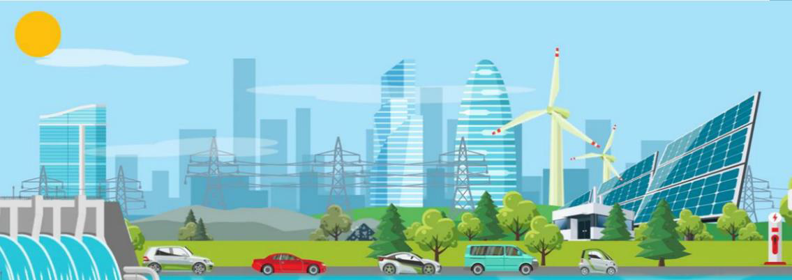

# Система учёта выдачи и обращения зелёных сертификатов на основе распределённого реестра

## Цель
Создать прототип системы учёта выдачи и обращения сертификатов, подтверждающих объём электроэнергии, выработанной с использованием возобновляемых источников энергии (зелёных сертификатов).
Система состоит из трёх блоков:
1) верификация процесса производства электроэнергии и выпуск сертификатов;
2) торговля сертификатам на организованной площадке;
3) ведение реестра сертификатов.
В зависимости от предпочтений участник выбирает один или несколько блоков.

Задачи (блоки):

1. Верификация процесса производства электроэнергии на основе использования возобновляемых источников энергии (ВИЭ) и выдача сертификатов.
Источник сведений для выдачи сертификатов – данные приборов коммерческого учёта электроэнергии, предоставляемые владельцем генерирующего объекта.
Сертификаты должны выдаваться только на те объемы электроэнергии, которые выработаны с использованием ВИЭ. Для этого проводится квалификация объектов генерации. Т.е. при квалификации объектов ВИЭ уполномоченный орган должен подтвердить, что выработка электроэнергии на объектах осуществляется строго лишь из возобновляемых источников энергии. Квалификация ВИЭ проводится не регулярно и путем визуального осмотра установления соответствия реальных условий выработки на объектах ВИЭ заявленным при квалификации схемам и источникам.
Требуются дополнительные способы верификации выработки электроэнергии на ВИЭ, чтобы исключить возможность выдачи сертификатов на объёмы электроэнергии, которые произведены не из возобновляемых
источников. В целях такой верификации данных выработки ВИЭ, например, можно автоматизировано устанавливать их соответствие данным изменения климатических параметров (температура воздуха, скорость ветра, инсоляция) в одни и те же периоды времени.
Разработанная участниками система должна на основании данных выработки электроэнергии на объектах ВИЭ и данных измерений климатических показателей осуществлять проверку их соответствия друг другу, и учитывать результаты такого соответствия при выпуске сертификатов.
Таким образом для выдачи сертификатов необходимо одновременное выполнение двух условий:
    1) процесс генерации в сопоставлении с данными из других источников отвечает заданным техническим критериям;
    2) выдача сертификатов авторизована уполномоченными валидаторами.
При положительном результате в отношении каждого мегаватт-часа заявленного объёма электроэнергии выдаётся и учитывается в системе уникальный зелёный сертификат с указанием генерирующего объекта, времени производства электроэнергии и других обязательных атрибутов.

2. Обеспечение торговли зелёными сертификатами на организованной торговой площадке.
Система обеспечивает регистрацию участников на торговой площадке в автоматическом режиме при соблюдении минимальных требований.
Предусматривается система финансовых гарантий: участники-покупатели вносят определённые суммы в депозит торговой площадки в качестве обеспечения исполнения обязательств по покупке сертификатов.
Торги на площадке проводится по принципу аукциона. стандартные договоры купли-продажи заключаются с претендентами, предложившими максимальные цены.
Покупателям обеспечивается возможность целенаправленного приобретения сертификатов с определёнными атрибутами: конкретный вид используемого ВИЭ и конкретная технология; выданные в определённый промежуток времени и (или) в определённом регионе, выданные в отношении конкретного генерирующего объекта.
Подведение итогов торгов осуществляется в автоматическом режиме на основе заданных критериев и правил.
Система регистрирует сделки, совершаемые при помощи стандартных контрактов, учитывает обязательства продавцов и покупателей сертификатов и контролирует выполнение расчётов, после чего сведения о совершённых сделках передаются для учёта в реестре сертификатов.

3. Ведение реестра сертификатов.
Сведения о переходе прав на сертификаты поступают:
    1) от участников торговли, продающих и покупающих сертификаты по прямым двусторонним сделкам вне организованной торговой площадки;
    2) от организатора торговли сертификатами на площадке.
Система обеспечивает учёт перехода прав в автоматическом режиме при соблюдении заранее оговорённых требований.
Обеспечивается непрерывность учёта от момента выдачи сертификата до его погашения или истечения срока действия.
Система должна гарантировать невозможность одновременной передачи сертификата по двум различным сделкам, невозможность передачи сертификата лицом, которому он не принадлежит по данным реестра, невозможность повторного учёта одного и того же сертификата как погашенного.

## Реализация:  
Прототип реализуется в форме распределённого реестра.
Исполнитель должен обосновать степень децентрализации реестра и соответствующий ей баланс между безопасностью, доверием и управляемостью.
Следует предусмотреть визуализацию основных функций прототипа в форме личных кабинетов владельцев генерирующих объектов и владельцев сертификатов.
Задача состоит из трех блоков:
1. Верификация (подтверждение) производства э/э и выдача сертификатов;
2. Ведение реестра сертификатов;
3. Торговая площадка (организация площадки).
Участники могут выбрать один или несколько блоков по своему желанию, например верификация и выдача, выдача и ведение реестра или только реестр, реестр и торговая площадка, все три блока и т.д.
Все блоки равноценны, при прочих равных условиях выше оценивается проект с решением большего числа блоков.

## Данные для демонстрации предлагаемых решений:  
В большей степени оценка проектов участников зависит от их презентации, в связи с этим от участников требуется максимальная наглядность реализации проектов. Например, можно продемонстрировать «личный кабинет» условных участников и аудиторов системы обращения сертификатов или уполномоченного на выпуск сертификатов органа.

Для облегчения визуализации участникам предлагаются следующие данные и формат их получения.
Исходные данные:
- фактическая выработка электроэнергии на СЭС и ВЭС;
- климатические условия: температура воздуха, скорость ветра, солнечная инсоляция.

Формат предоставления: ежесекундно передаются POST запросы содержащие среднее значение каждого параметра за равные промежутки времени (5–10 минут) в формате json.
Для получения данных необходимо:
- Создать web-сервис;
- Написать http-ссылку на свой сервис телеграм-боту @NPSR_greencert_bot;
По этому адресу должен быть web-сервис, принимающий POST запросы, содержащие данные в json-формате вида [размерность]: 

        "timestamp": 1557800100,
        "id": 1/2/3,
        "pwr_avg": 4, [кВт]
        "wind_spd": 2.1, [м/с]
        "t": 0.3, [С]
        "insolation": 0,  [кВт*ч/м2]

Всего в ситеме три агрегата: 1 и 2 - солнечные, 3 – ветряк
